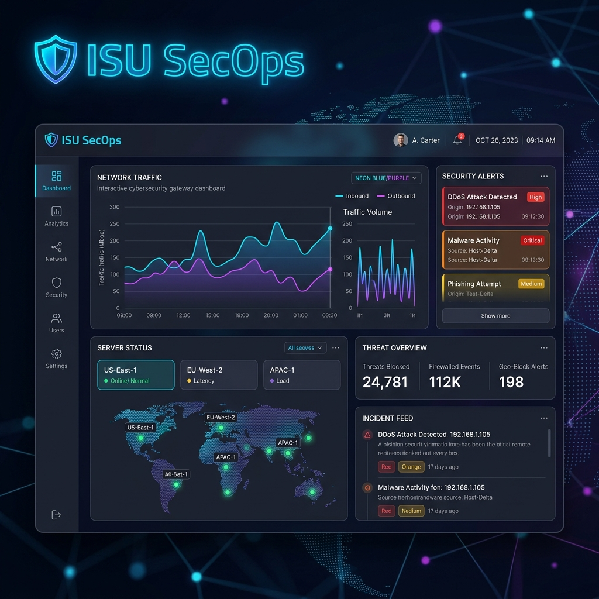
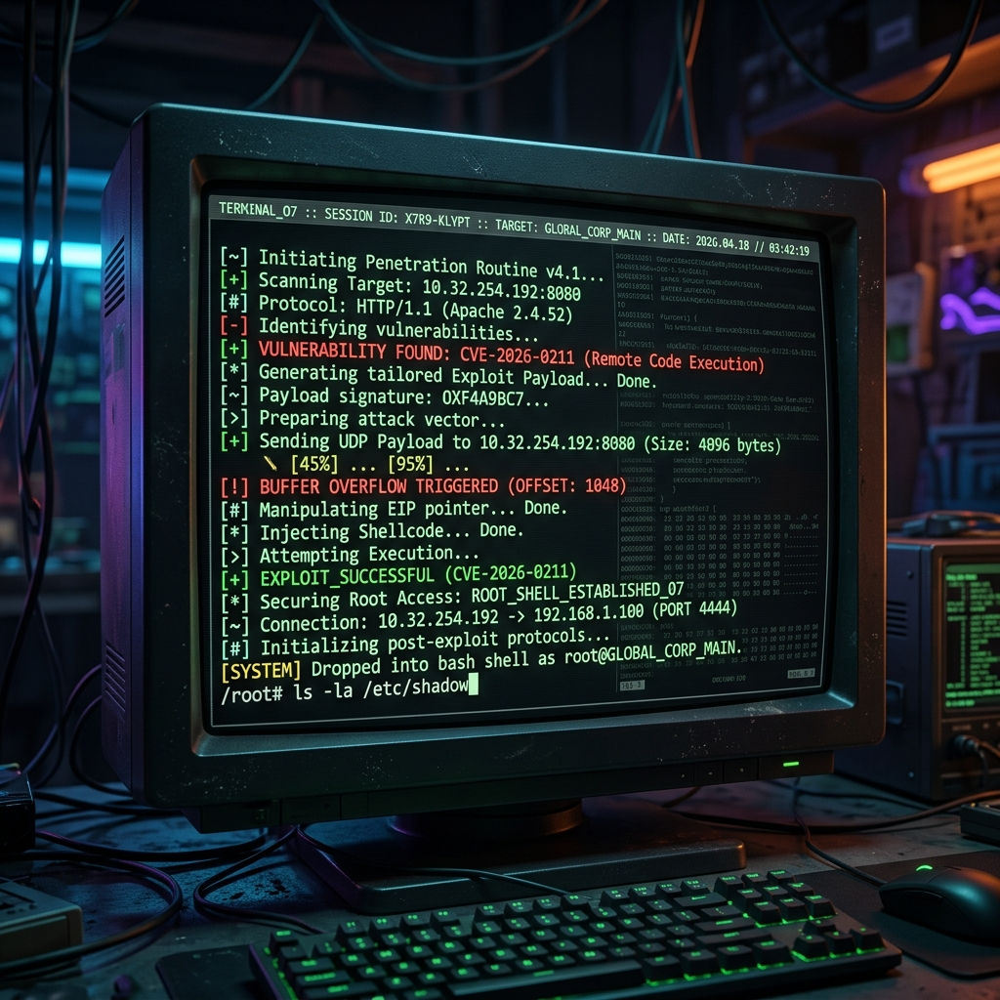
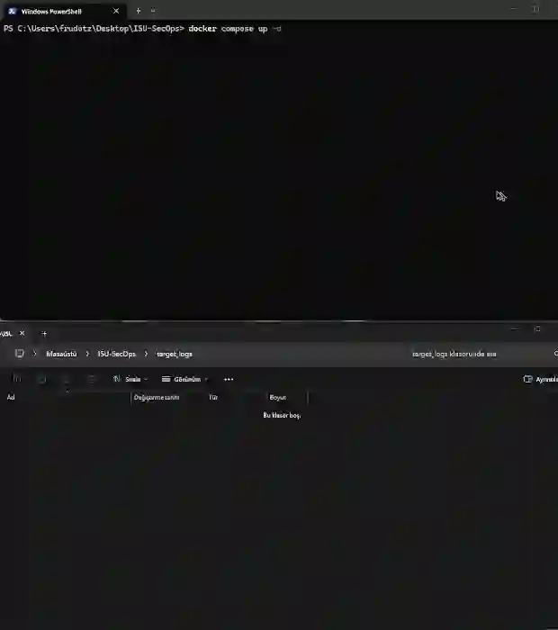

# ISU-SecOps Nginx QUIC RCE Lab

Modern web sunucularındaki (Nginx) HTTP/3 ve QUIC protokolü zafiyetlerini analiz etmek, tetiklemek (Exploitation) ve savunmak (Mitigation) amacıyla geliştirilmiş kapsamlı bir eğitim laboratuvarıdır.

Bu proje, gerçek dünya saldırı senaryolarını hedefleyen, RCE ve DoS testleri içeren modüler bir "Saldırı ve Savunma" çözümü olarak tasarlanmıştır.


---

|  | Sızma Testi Proje Ödevi |
|---|---|
| **Öğrenci Adı** | Hamza Arda Karabacak |
| **Öğrenci No.** | 2520191010 |
| **Öğretim Gör. (Danışman)** | Keyvan Arasteh Abbasabad |
| **Ders Kodu & Adı** | BGT006 Sızma Testi |

---

## 📚 İçindekiler

- [🚀 Özellikler](#-özellikler)
- [🌐 Üretim Benzetimi (Mock Website)](#-üretim-benzetimi-mock-website)
- [🧠 Mimari Yaklaşım](#-mimari-yaklaşım)
- [⚙️ Kullanım](#️-kullanım)
  - [Docker Ortamı](#docker-ortamı)
  - [Saldırı Araçları](#saldırı-araçları)
- [🛡️ Savunma ve Yama](#️-savunma-ve-yama)
- [🧪 CI/CD Testing](#-cicd-testing)
- [📁 Çıktılar ve Dokümantasyon](#-çıktılar-ve-dokümantasyon)
- [⚠️ Yasal Uyarı / Limitations](#️-yasal-uyarı--limitations)
- [🧾 Versiyon](#-versiyon)
- [📌 Not](#-not)

---

## 🚀 Özellikler

* **CVE-2026-0211 Simülasyonu:** Nginx QUIC parser modülündeki `dcid_len` tabanlı Heap Buffer Overflow zafiyeti.
* **Keşif (Recon):** Hedef sistemde HTTP/3 (QUIC) taraması ve tespiti (`01_recon.py`).
* **Hizmet Reddi (DoS):** Asimetrik asenkron istekler ile memory/CPU tüketim saldırısı (`03_dos.py`).
* **Kaynak Kodu Yamalama:** Zafiyetli C dosyası için Bounds Checking yaması (`CVE-2026-0211-defense.patch`).
* **Gelişmiş Mitigasyonlar:** eBPF (XDP) tabanlı paket düşürme ve ModSecurity WAF kuralları analizi.
* **İzole Laboratuvar:** Docker Compose ile 10.13.37.0/24 internal bridge network.

---

## 🎬 Canlı Demo ve Ekran Görüntüleri

Projenin çalışan halini yansıtan konsept ekran görüntüleri aşağıdadır:

### 🖥️ Siber Güvenlik Arayüzü (Web GUI)
Mock Website, saldırganların hedeflediği "ISU SecOps" enterprise ağ geçidini canlandırır:


### 👨‍💻 Hacker Uçbirimi (CLI / Exploit Execution)
Saldırı betiklerinin çalıştırılması ve Nginx sunucusundaki QUIC Buffer Overflow zafiyetinin tetiklenme anı:


### 🎥 Canlı Demo Videosu (Sistem İşleyişi)
Projenin uçtan uca çalıştırılması, zafiyetin sömürülmesi ve hedefin düşürülme anını gösteren canlı demo videosu:



*(Eğer video tarayıcı veya Markdown okuyucunuzda oynamıyorsa, `assets/demo/live-demo.mp4` yolundan yerel olarak izleyebilirsiniz.)*

---

## 🌐 Üretim Benzetimi (Mock Website)

Hedef Nginx sunucusu, zafiyetin gerçek dünyadaki etkisini göstermek adına interaktif ve karanlık temalı bir **"Enterprise Security Gateway"** web arayüzüne ev sahipliği yapmaktadır. Bu sayede sadece bir "It Works" sayfası değil, kurumsal görünümlü bir üretim (production) sunucusuna sızma testi gerçekleştirilir.

---

## 🧠 Mimari Yaklaşım

Proje 4 ana katmandan oluşur:

* **Hedef (Target) Katmanı:** Zafiyet barındıran Nginx 1.25.3 Docker container'ı ve mock website.
* **Saldırı (Attack) Katmanı:** Python tabanlı QUIC fuzzer, DoS ve Payload (JSON) modülleri.
* **Savunma (Defense) Katmanı:** Orijinal C yamaları ve Kernel tabanlı eBPF çözüm önerileri.
* **Dokümantasyon Katmanı:** Tehdit analizi, fuzzer metodolojisi, crash triage ve benchmarking raporları.

Bu yapı sayesinde sistem modüler, eğitici ve gerçeğe yakın bir zafiyet araştırma (VulnDev) deneyimi sunar.

---

## ⚙️ Kullanım

### Docker Ortamı

Projeyi kendi bilgisayarınızda (localhost) kurmak için Docker Compose kullanılır:

```bash
docker compose up -d --build
```
*Bu komut; `target_nginx` konteynerini 10.13.37.10 IP adresiyle ayağa kaldırır ve HTTP/3 desteğiyle çalıştırır.*

### Saldırı Araçları

Gerekli Python bağımlılıklarını kurduktan sonra saldırı betiklerini başlatabilirsiniz:

**Keşif Aşaması (Recon):**
```bash
docker exec fuzzer_node python3 /fuzzer/01_recon.py 10.13.37.10 443
```

**DoS Saldırısı:**
```bash
docker exec fuzzer_node python3 /fuzzer/03_dos.py 10.13.37.10 443 10
```

*Not: Hata (Crash) tespitlerini görmek için Nginx loglarını kontrol edebilirsiniz:*
```bash
docker exec target_nginx cat /var/log/nginx/asan.7
```

---

## 🛡️ Savunma ve Yama

Bu laboratuvar sadece saldırmayı değil, savunmayı da öğretir. Nginx kaynak koduna aşağıdaki gibi bir sınır kontrolü (Bounds Checking) eklenmiştir:

```c
if (idlen > NGX_QUIC_CID_LEN_MAX || idlen == 0xFF) {
    ngx_log_error(NGX_LOG_INFO, c->log, 0, "quic invalid dcid_len detected");
    return NGX_DECLINED;
}
```
*Detaylı C-patch içeriği `savunma/CVE-2026-0211-defense.patch` dosyasında bulunabilir.*

---

## 🧪 CI/CD Testing

Proje, GitHub Actions üzerinde tam otomatik DevSecOps pipeline'ına sahiptir:
* Kod her pushlandığında Docker ortamı Actions runner üzerinde ayağa kalkar.
* Fuzzer testleri otomatik çalıştırılır.
* AddressSanitizer (ASAN) logları taranarak yamanın çalışıp çalışmadığı denetlenir (`.github/workflows/security_test.yml`).

---

## 📁 Çıktılar ve Dokümantasyon

Akademik seviyedeki tüm araştırma çıktıları `dokumantasyon/` klasörü altındadır:

1. Tehdit Analizi
2. Fuzzing Metodolojisi
3. Crash Triage (Root Cause Analysis)
4. İleri Mitigasyon Stratejileri (WAF/eBPF)
5. Performans ve Benchmarking Tablosu

---

## ⚠️ Yasal Uyarı / Limitations

* **Sadece İzin Verilen Ortamlar:** Buradaki araçlar yalnızca kendi kontrol ettiğiniz izole Docker sistemlerinde kullanılmalıdır.
* **Sorumluluk Reddi:** Yetkisiz sistemlere karşı yapılan hiçbir eylemden proje sahipleri sorumlu tutulamaz.
* Sistem gerçek bir Zero-Day yerine (CVE-2026-0211 hipotetik) Nginx QUIC mantığının eğitim amaçlı zaafiyete uğratılmış özel bir versiyonu üzerine kuruludur.

---

## 🧾 Versiyon

v1.0.0

---

## 📌 Not

Bu proje, Sızma Testi, Güvenlik Zafiyeti Keşfi (VulnDev) ve DevSecOps süreçlerinin temel prensiplerini akademik bir yaklaşımla göstermek amacıyla geliştirilmiştir.
